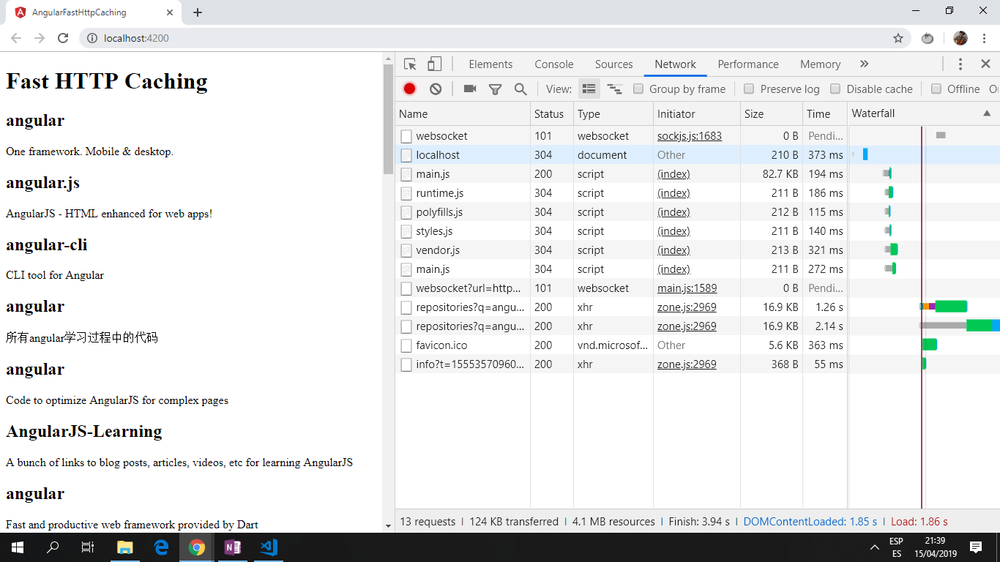

# :zap: Angular Fast Http Caching

* Uses HTTP Angular (asynchronous) Observables with RxJS (JS version of Reactive library) and browser local storage to show a locally cached version of API data.
* Replaced by real data once the network request has completed.
* **Note:** to open web links in a new window use: _ctrl+click on link_


## :page_facing_up: Table of contents

* [:zap: Angular Fast Http Caching](#zap-angular-fast-http-caching)
  * [:page_facing_up: Table of contents](#page_facing_up-table-of-contents)
  * [:books: General info](#books-general-info)
  * [:camera: Screenshots](#camera-screenshots)
  * [:signal_strength: Technologies](#signal_strength-technologies)
  * [:floppy_disk: Setup](#floppy_disk-setup)
  * [:computer: Code Examples](#computer-code-examples)
  * [:cool: Features](#cool-features)
  * [:clipboard: Status & To-Do List](#clipboard-status--to-do-list)
  * [:clap: Inspiration](#clap-inspiration)
  * [:file_folder: License](#file_folder-license)
  * [:envelope: Contact](#envelope-contact)

## :books: General info

* "Observables are a new way of pushing data in JavaScript. An observable is a Producer of multiple values, “pushing” them to subscribers."
* Shows github repos using a search term 'angular'.

## :camera: Screenshots

.

## :signal_strength: Technologies

* [Angular v14](https://angular.io/)
* [RxJS Library v7](https://angular.io/guide/rx-library) used to handle datastreams and propagation of change using observables.
* [RxJS startWith operator](http://reactivex.io/documentation/operators/startwith.html) used to emit a specified sequence of values before beginning to emit the items from the source Observable.
* [The HttpClient in @angular/common/http](https://angular.io/guide/http) offers a simplified client HTTP API for Angular applications that rests on the XMLHttpRequest interface exposed by browsers.

## :floppy_disk: Setup

* `npm i` to install dependencies
* Run `ng serve` for a dev server.
* Navigate to `http://localhost:4200/`. The app will automatically reload if you change any of the source files.

## :computer: Code Examples

* `app.component.ts` _subscribe to github repo and use http caching_

```typescript
export class AppComponent implements OnInit {
  title = "angular-fast-http-caching";
  repos: any;

  constructor(private http: HttpClient) {}

  ngOnInit() {
    this.getRepos();
  }

  getRepos() {
    const path = "https://api.github.com/search/repositories?q=angular";
    this.repos = this.http.get<any>(path).pipe(map((data: any) => data.items));

    this.repos.subscribe((next: any) => {
      console.log("next data: ", next, typeof next); // type=object
      localStorage[CACHE_KEY] = JSON.stringify(next); // store in local storage
    });

    this.repos = this.repos.pipe(
      startWith(JSON.parse(localStorage[CACHE_KEY] || "[]"))
    );
  }
}
```

## :cool: Features

* An Angular HTTP Observable is combined with RxJS and the browser's local storage to automatically serve up a locally cached version that gets replaced by the real data as soon as the network request is finished.

## :clipboard: Status & To-Do List

* Status: Working.
* To-Do: nothing.

## :clap: Inspiration

* [Youtube tutorial by 'Digital Fluency', Fast HTTP Caching With Angular HTTP Observables](https://www.youtube.com/watch?v=Yf1FfhMetjs&t=535s).
* [Luuk Gruijs, Medium article, "Understanding, creating and subscribing to observables in Angular"](https://medium.com/@luukgruijs/understanding-creating-and-subscribing-to-observables-in-angular-426dbf0b04a3)

## :file_folder: License

* This project is licensed under the terms of the MIT license.

## :envelope: Contact

* Repo created by [ABateman](https://github.com/AndrewJBateman), email: gomezbateman@yahoo.com
